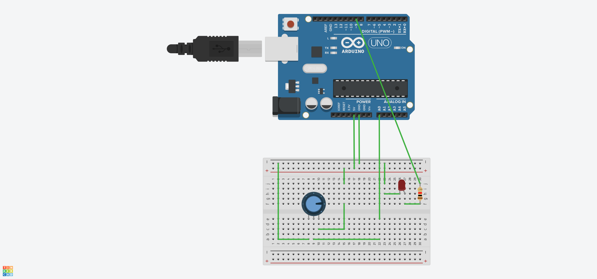

## Arduino学习
> 电路模拟地址：https://www.tinkercad.com/
#### 1.电位器控制LED的亮度
```javascript
void setup() {
  // put your setup code here, to run once:
  Serial.begin(9600);
  pinMode(9,OUTPUT);

}

void loop() {
  // put your main code here, to run repeatedly:
  int getInputVal=analogRead(A0);
  int showVal=map(getInputVal,0,1023,0,255);
  analogWrite(9,showVal);
  
}
```


