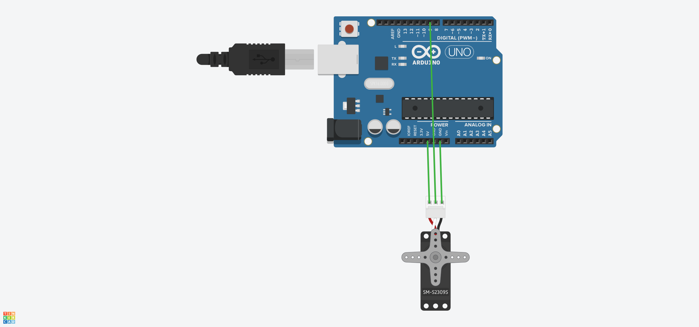

## Arduino学习
> 电路模拟地址：https://www.tinkercad.com/
#### 1.电位器控制LED的亮度
```javascript
void setup() {
  // put your setup code here, to run once:
  Serial.begin(9600);
  pinMode(9,OUTPUT);

}

void loop() {
  // put your main code here, to run repeatedly:
  int getInputVal=analogRead(A0);
  int showVal=map(getInputVal,0,1023,0,255);
  analogWrite(9,showVal);
  
}
```


#### 2.伺服电机(舵机)
```javascript
/* Sweep
 by BARRAGAN <http://barraganstudio.com>
 This example code is in the public domain.

 modified 8 Nov 2013
 by Scott Fitzgerald
 https://www.arduino.cc/en/Tutorial/LibraryExamples/Sweep
*/

#include <Servo.h>

Servo myservo;  // create servo object to control a servo
// twelve servo objects can be created on most boards

int pos = 0;    // variable to store the servo position

void setup() {
  Serial.begin(9600);
  myservo.attach(9);  // attaches the servo on pin 9 to the servo object
}

void loop() {
  for (pos = 0; pos <= 180; pos += 45) { // goes from 0 degrees to 180 degrees
    // in steps of 1 degree
    myservo.write(pos);              // tell servo to go to position in variable 'pos'
    Serial.println(pos);
    delay(1000);                       // waits 15 ms for the servo to reach the position
  }
  for (pos = 180; pos >= 0; pos -= 45) { // goes from 180 degrees to 0 degrees
    myservo.write(pos);              // tell servo to go to position in variable 'pos'
    Serial.println(pos);
    delay(1000);                       // waits 15 ms for the servo to reach the position
  }
}
```


