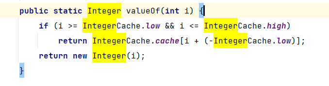

### 方法的参数传递机制

#### 1.实参给形参赋值 :
> 基本数据类型: 数据值
> 
> 引用数据类型:地址值

#### 2.方法的参数传递机制:

**① 形参是基本数据类型**

> - 传递数据值

**② 实参是引用数据类型**
> - 传递地址值
>
> - 特殊的类型:String、包装类等对象不可变性

#### 3.代码实现

[ParameterMethod.java](..%2F..%2Fsrc%2Fmain%2Fjava%2Fcom%2Fexample%2Fjavainterview%2FVersion01%2FParameterMethod.java)
```java

public class ParameterMethod {
    public static void main(String[] args) {
        int i = 1;
        String str = "hello";
        Integer num = 200;
        int[] arr = {1,2,3,4,5};
        MyData my = new MyData();
        change(i, str ,num, arr ,my ) ;
        System.out.println("i = " + i);
        System.out.println("str = " + str);
        System.out.println("num = " + num);
        System.out.println("arr = " + Arrays.toString(arr));
        System.out.println("my.a = " + my.a);
    }
    public static void change(int j, String s, Integer n, int[] a,MyData m){
        j += 1;
        s+="world";
        n += 1;
        a[0] += 1;
        m.a += 1;
    }
}
class MyData {
    int a=10;
}

```

#### 4.总结

> 理解这种方法的参数传递机制其实很简单,首先先看这种参数的传递是值传递还是引用传递。
> 
> 有人可能会问，我怎么知道这个是值传递还是引用传递呢，最简单的方法就是这个是不是基本数据类型。
> 或者你可以看这个类型是不是类，也就是是不是Object的子类。是值传递，不要想了，变量的值在另一个方法栈中是不会改变的。
> 
> 这个时候就剩下引用变量的传递了，这个时候你需要看引用变量在另一个方法栈中进行一系列的运算会不会产生新的对象，如果会的话，那值也不会改变。
> 就比如题目中的（String,Integer等）

**Integer的运算就会产生一个新的对象**


